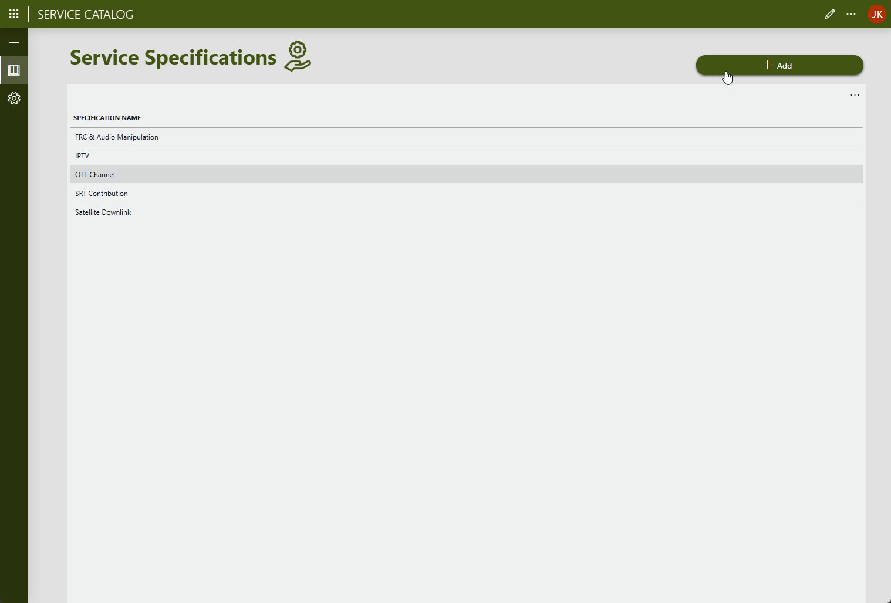
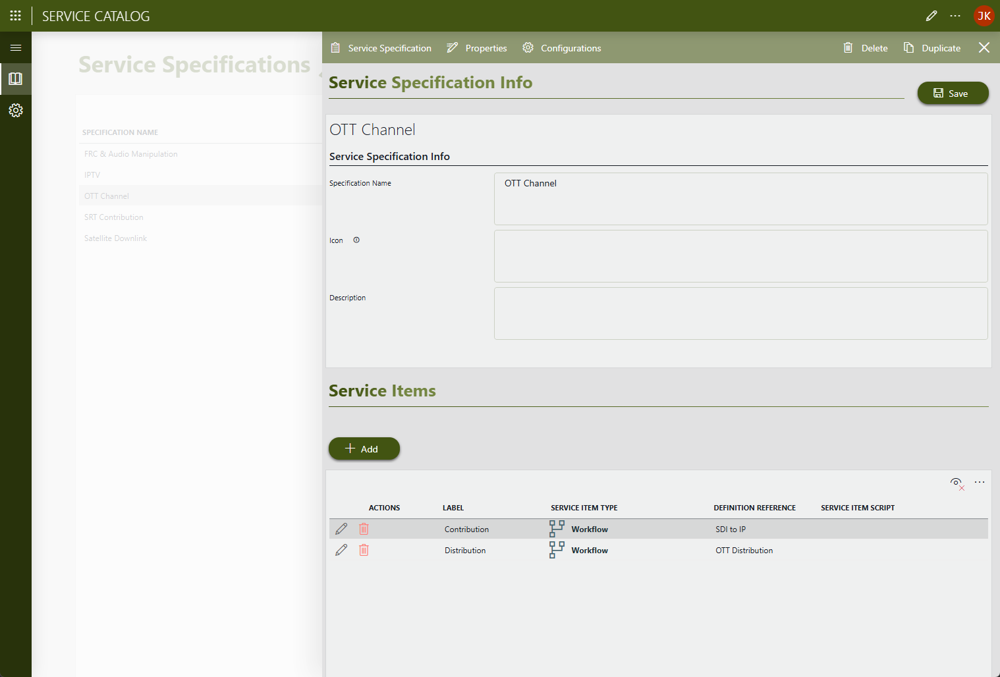
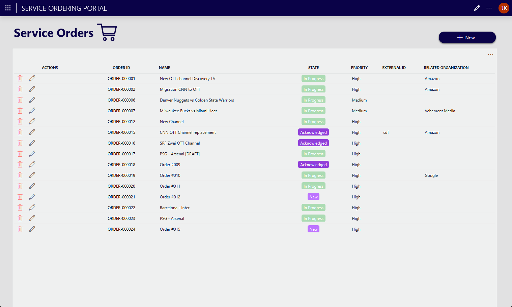
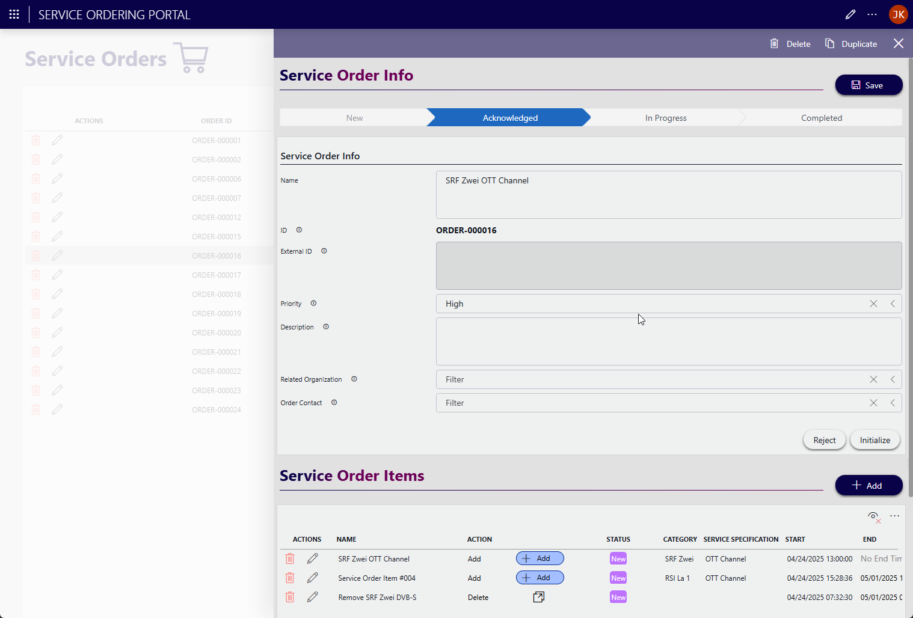
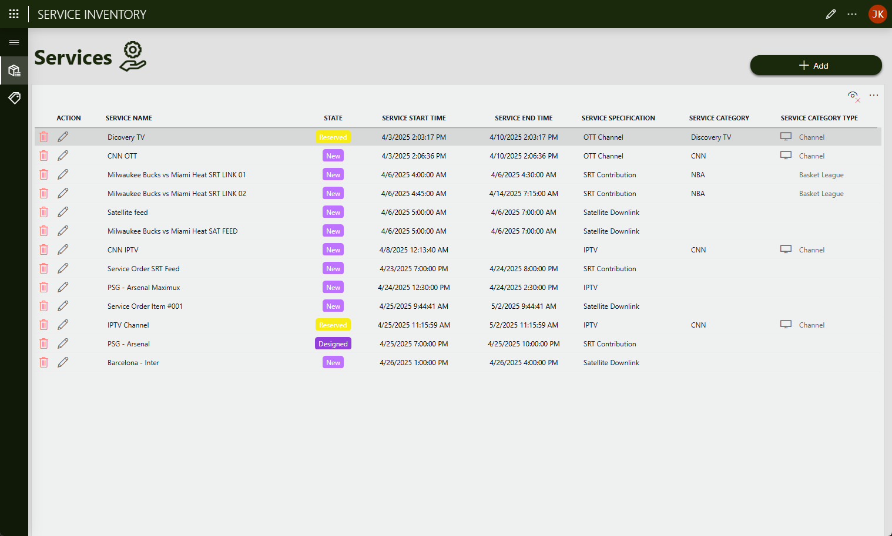
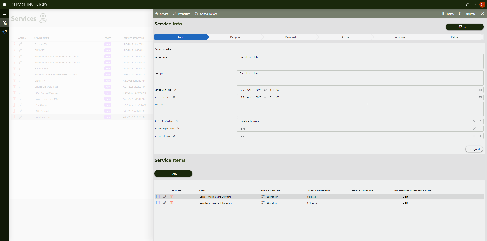

# Service Management

## About

This package contains a framework (data model) and a number of sample applications that you can use to **manage the end-to-end life cycle of services** within your organization.

The end-to-end service life cycle within the framework aims to handle design, testing, ordering, inventorying, orchestration, assurance, change and deletion of services, up to costing and billing. In order to offer a modular architecture in line with industry standards, the framework is based on [TM Forum Open APIs](https://www.tmforum.org/oda/open-apis/directory).

The current state of the framework is focused on:

- Design (Service Specifications)
- Ordering (Service Order Portal)
- Inventorying (Service Inventory)

Other aspects of the service life cycle will be handled by gradually added features.

> [!NOTE]
>
> - The package makes use of MediaOps as reservation and orchestration layer for the service item components within the services in this framework.
> - The applications part of this package will consume DataMiner credits, based on the level of usage of the apps. The DataMiner credits will be deducted monthly based on the metered usage. More information about the pricing of DataMiner usage-based services can be found in the [DataMiner Pricing Overview](https://docs.dataminer.services/dataminer-overview/Pricing/Pricing_Usage_based_service.html).

## Key Features

### Future TMF compliance

The goal is to make the Service Management framework within DataMiner compatible with [TM Forum APIs](https://www.tmforum.org/oda/open-apis/directory).

TM Forum is a global industry association for service providers and their suppliers in the telecommunications and digital services sectors. Its main purpose is to provide standardized frameworks (including APIs) and collaborative tools that help companies reduce complexity, improve interoperability, and accelerate service delivery.

### Service Catalog

The Service Catalog allows to define **service specifications**, i.e. end-to-end descriptions of what a service of a specific type should consist of.

A service specification contains one or more service items, which can be either xOps workflows (resulting in jobs) or references to SRM booking managers (resulting in SRM bookings). Next to the service items, the specification allows to define the properties and configurations required. These properties and configuration parameters are used in operation to orchestrate and inventory the services delivered.

### Service Ordering Portal

The Service Ordering Portal app allow to create and view service orders.

Service orders can either be created manually or by means of [TM Forum](https://www.tmforum.org/oda/open-apis/directory/service-ordering-management-api-TMF641/)-compatible APIs. Through a service order Item, an actual service is ordered, based on what is defined in the service specification in the Service Catalog.

The order will pass through a stateful life cycle, and will be updated when the actual services that are created in the Service Inventory evolve.

### Service Inventory

The Service Inventory app provides an overview of all the services in the system.

Services can either be created directly from the Service Inventory app, via an API or originating from an order in the Service Ordering Portal. A service contains one or more service items (workflows or SRM bookings) as defined in the service specification that was used to initiate the service. The service will also inherit all the properties and configurations from a service specification.

## Use Cases

Services within this framework can serve multiple **use cases** in different industries:

- **Satellite**

  - Uplink and downlink services
  - VSAT terminals

- **Media & Broadcast**

  - Event management
  - Channel management

- **Telecommunications**

  - Fixed network services
  - Mobile services

- **IT**

  - Software services
  - Hardware services
  - Security services

## Prerequisites

- MediaOps version 1.2.3 (exact version): Can be deployed directly from the [Catalog](https://catalog.dataminer.services/details/1b67a623-4ca6-4d25-8b3d-ed4e39496a75).

## Technical Reference

For additional help or to discuss additional use cases, please reach out to [Skyline Product Marketing](mailto:team.product.marketing@skyline.be).
